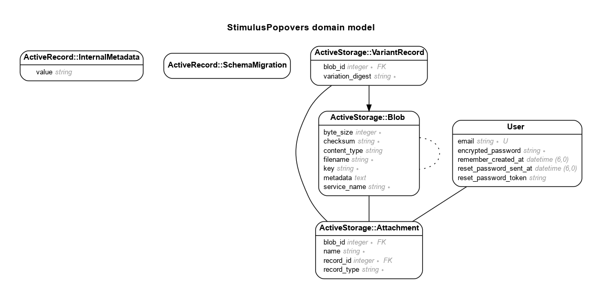

# Stimulus Popovers For Devise Users With Avatars


## Features

## Model

Generated by Rails ERD. Run rails erd to regenerate (must have graphviz).


## Version

- ruby 3.1.2
- Rails 7.0.4.3

## Steps

- rails new stimulus-popovers -T
- Add boostrap to application.html.erb
  ```html
  <link
    href="https://cdn.jsdelivr.net/npm/bootstrap@5.3.0-alpha1/dist/css/bootstrap.min.css"
    rel="stylesheet"
    integrity="sha384-GLhlTQ8iRABdZLl6O3oVMWSktQOp6b7In1Zl3/Jr59b6EGGoI1aFkw7cmDA6j6gD"
    crossorigin="anonymous"
  />
  <script
    src="https://cdn.jsdelivr.net/npm/bootstrap@5.3.0-alpha1/dist/js/bootstrap.bundle.min.js"
    integrity="sha384-w76AqPfDkMBDXo30jS1Sgez6pr3x5MlQ1ZAGC+nuZB+EYdgRZgiwxhTBTkF7CXvN"
    crossorigin="anonymous"
  ></script>
  ```
- Add gems
  ```rb
  gem "sassc-rails"
  gem "image_processing", "~> 1.2"
  gem "devise"
  gem "simple-form"
  # Development group:
  gem "annotate" # Add a comment summarizing the current schema
  gem "rails-erd" # Generate Entity-Relationship Diagrams
  gem "erb-formatter" # Format ERB Files
  gem "letter_opener" # Preview emails
  gem "chusaku", require: false # Annotate controllers
  ```
- Add 1) stimulus-popover JS library, 2) a new stimulus controller and 3) a new controller 4) install simple form 5) install devise 6) add devise views 7) add devise controllers 8) install active storage 9) Add users controller
  ```sh
  bin/import pin stimulus-popover
  rails g stimulus popover
  rails g controller pages home
  rails g simple_form:install --bootstrap
  rails g devise:install
  rails g devise user
  rails g devise:views
  rails g devise:controllers users
  rails active_storage:install
  rails g controller users
  ```
- In popover_controller.js:

  ```js
  // import { Controller } from "@hotwired/stimulus"
  import Popover from "stimulus-popover";

  // Connects to data-controller="popover"
  export default class extends Popover {
    connect() {
      // call Popover's connect
      super.connect();
      console.log("Popover controller connected");
    }
  }
  ```

## References

- Stimulus Components - https://www.stimulus-components.com/docs/stimulus-popover
